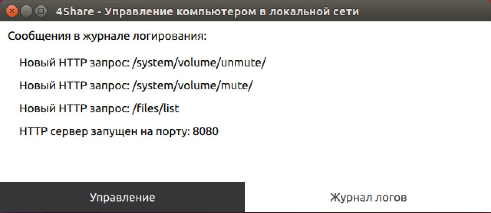

# 4Share

## Программа для управления компьютером в локальной сети

### Страница управления конфигурацией программы

Доступно:
- изменение порта веб сервера с его последующим перезапуском;
- изменение пути к просматриваемой корневой директории.

### Страница журнала логирования

